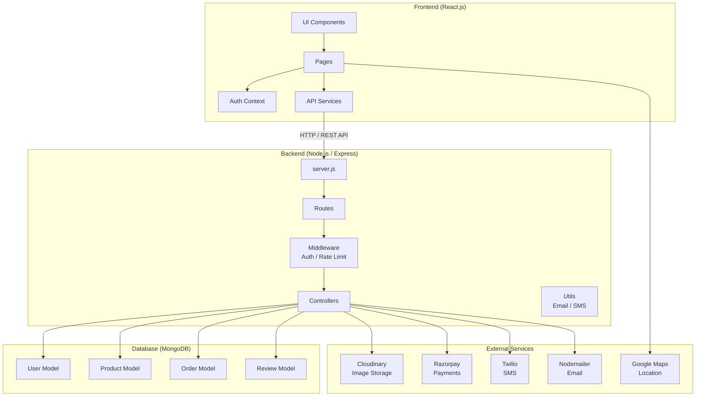
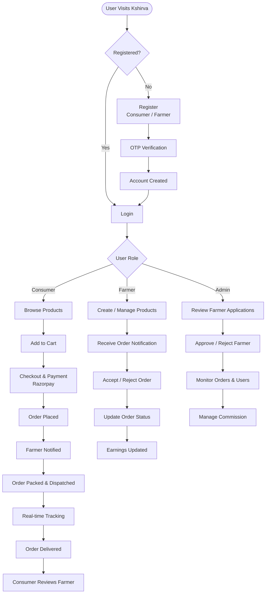
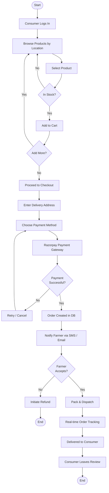
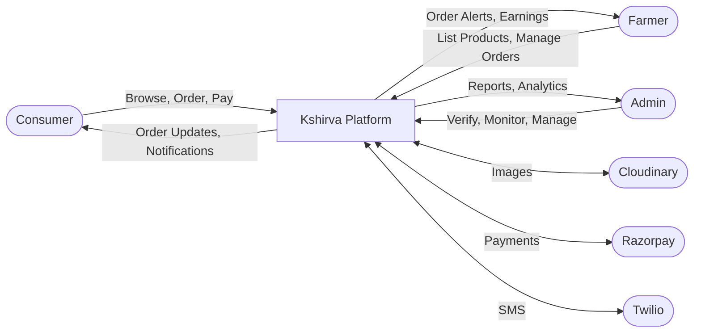
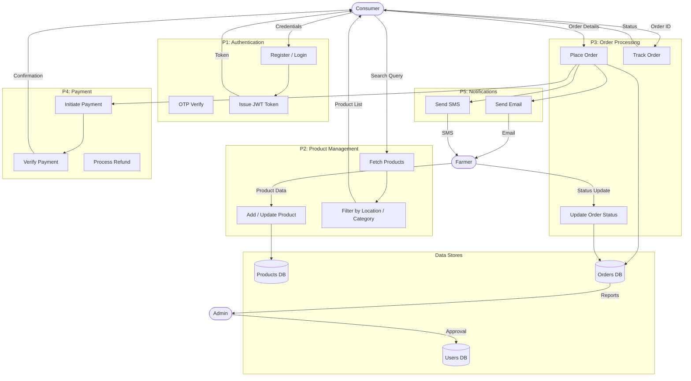

# Kshirva - System Diagrams

## 1. Component (CO) Diagram

---

## 2. Workflow Diagram

---

## 3. Flowchart — Order Placement

---

## 4. Data Flow Diagram (DFD)

### Level 0 — Context Diagram

### Level 1 — Detailed DFD

